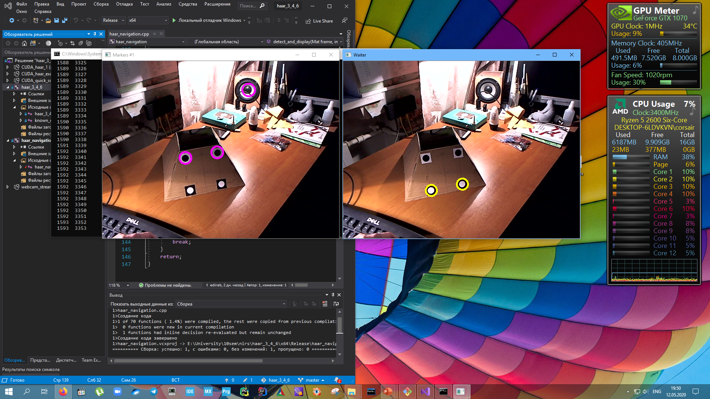
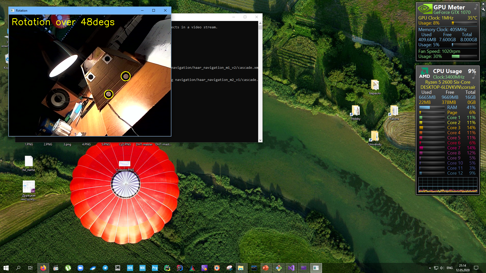

### Навигация с помощью распознавания маркеров специального вида

##### Содержимое репозитория

- Чертежи маркеров специального вида для детектирования - **designing markers**

- Пример работы каскада по детектированию Ждуна - в папке **/haar_3_4_6**

- Детектирование маркеров специального вида: **/haar_navigation**

- Подготовка данных и инструкция по обучению каскада и тестовое видео - папка **/preparing waiter**

    - Папка **extracted_images** с подготовленным набором исходных изображений для обучения
	- Обученные каскадные классификаторы находятся в папках **/preparing_data/haar_results_vХ/**
	    + для каждого каскада имеется файл **samples\*.vec**
	    + **OUTPUT.log**
	- Скрипты для автоматизации администрирования файлов
	    + **create_bad_dat.py** - создание файла с фоновыми изображениями
	    + **find_wrong_good.py** - проверка *good.dat* на наличие ошибок
	    + **move_files.py** - перемещение уже обработанных изображений в поддиректорию 
	    (в случае прежджевременного завершения работы *opencv_annotation.exe*)
	    + **fix_pathes.py** - для исправления путей файлов после перемещения
	     
	- Файлы **bad.dat**, **good.dat** && **good_fixed.dat**
	- вложенный **readme.md** с подробной инструкцией по подготовке данных и обучению каскада

- Сформированные файлы аннотаций и обученные каскады распознавания маркеров - **/preparing navigation**

***
	

***

### О том, как высчитывать fps алгоритма

https://stackoverflow.com/questions/22148826/measure-opencv-fps

***

### Кодировка в Visual Studio, как включить utf-8?

> Есть ли способ изменить кодировку файлов в Visual Studio на utf-8? Так, чтобы это было 
> на постоянной основе. Нашел только один способ, но он меняет кодировку только одного файла 
> из (к примеру) сотни уже имеющихся. Это

	File -> Advanced Save Options и в списке Encoding выбрать UTF-8

**Ответ**

> Для автоматического сохранения в UTF-8 всех новых файлов, содержащих символы, 
> отличные от набора ASCII, необходимо включить опцию - 

	Tools > Options > Environment > Documents > Save documents as Unicode when data cannot be saved in codepage 

https://coding.likeflow.ru/2018/10/visual-studio-utf-8.html

*** 

http://pr0git.blogspot.com/2015/02/git_4.html

