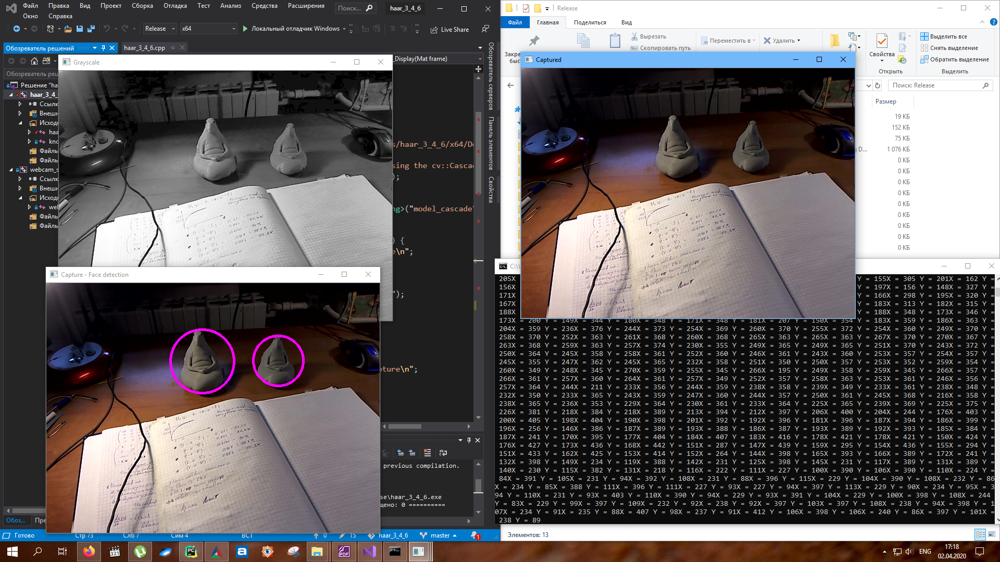
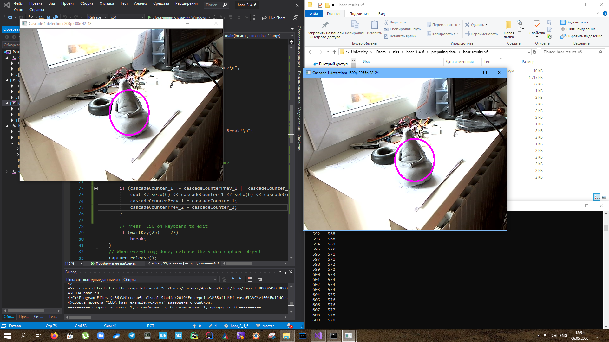

### 1. Пример обучения каскада Хаара

##### Содержимое репозитория

- Пример работы каскада - в папке **/haar_3_4_6**

- Видео **waiter.mp4** в качестве тестового

- Подготовка данных и обучение - папка **/preparing data**

    - Папка **extracted_images** с подготовленным набором исходных изображений для обучения
	- Обученные каскадные классификаторы находятся в папках **/preparing_data/haar_results_vХ/**
	    + для каждого каскада имеется файл **samples\*.vec**
	    + **OUTPUT.log**
	- Скрипты для автоматизации администрирования файлов
	    + **create_bad_dat.py** - создание файла с фоновыми изображениями
	    + **find_wrong_good.py** - проверка *good.dat* на наличие ошибок
	    + **move_files.py** - перемещение уже обработанных изображений в поддиректорию 
	    (в случае прежджевременного завершения работы *opencv_annotation.exe*)
	    + **fix_pathes.py** - для исправления путей файлов после перемещения
	     
	- Файлы **bad.dat**, **good.dat** && **good_fixed.dat**
	- вложенный **readme.md** с подробной инструкцией по подготовке данных и обучению каскада
	

	

***

### 2. Сравнение двух каскадов: haar_results_v2 vs haar_results_v6:

Второй каскад (слева) имел много больше False Positive срабатываний
***
### 3. Сводная таблица параметров каскадов

Название |      Позитивных |      Негативных |      Width |         Height   | unique features | Time |
--------------- | ------------- | ------------- | ------------- | ------------- | ------------- | -----------
haar_results_v6 |   1500    |      2955      |      22       |      24       |    219 180    |  1h 23m 03s
haar_results_v5 |   1200    |      2955      |      22       |      24       |    219 180    |  1h 04m 31s
haar_results_v4 |   200     |       600      |      22       |      24       |      219 180  |  0h 02m 02s
--------------- |   ---     |       ---      |      --       |      --       |    --- ---    |  -- -- --
haar_results_v3 |   200     |       600      |      33       |      36       |    1 121 307  |  1h 22m 21s
haar_results_v2 |   200     |       600      |      42       |      48       |    3 239 144  |  1h 50m 52s
haar_results_v7 |   1500     |     2955      |      42       |      48       |    3 239 144  |  not finished

#### 4. Выводы:

1. Как видно из таблицы, колчество уникальных свойств зависит от размера окна сканирования
2. 